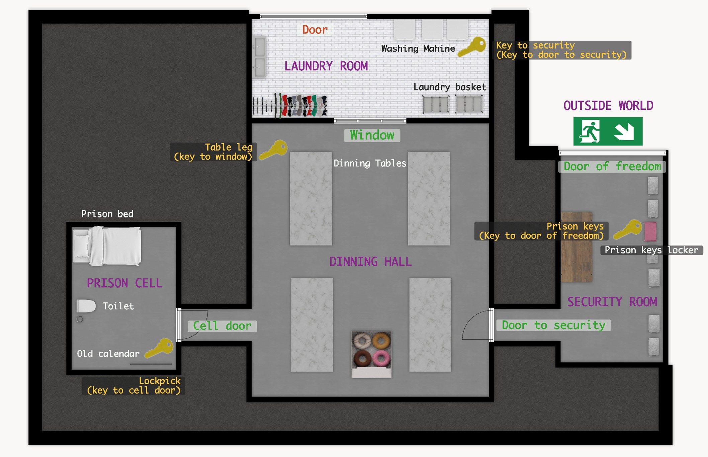

# Project: Prison Escape Python Game

## Overview

The goal of this project is to apply the Python programming skills we have learned this week in solving a real problem. We present you the design of a classic game that can be played via text - Prison Escape. Our goal is to develop the game using Python based on the game design.

Read the game narratives. Plan how you will achieve your goal to escape the Prison. The logic and process were maintained in order to avoid potential errors. Then implemented with the Python code.
---

## Game Design

### Game Map

### Game Narratives
"As usual you wake up in a prison cell and, once again, find yourself covered in cockroaches. Staring at the same four grey walls made of cold, smooth cement.The only sign that there's a world outside those four walls is your cell door. All of the sudden, you really miss your dog. A grey pitbull called Butcher. Your desire to be reunited with your four-legged best friend is now too great to fathom so you make the ultimate decision. To escape from this damn prison."

## Prison Cell

You are now in prison cell.

What would you like to do? You have two choices: Look Around or Examine items  

If you choose to "look around" the room. This is Prison Cell. You will find :  an old calendarl, cell bed, toilet, and cell door.

If you chooese to "examine" an item. You will be asked what you want to examine. But remember there is a key to open cell door hiding in one of items in the room. 

If you examine the cell door and you already don't have the key, it will not open. 

Lucky you! You are able to collect the key. You already open the door. You will be asked if you want to go in another room or not. If you want type "yes", if you dont want to go type "no"

#### Dinning Hall

You are now in Dinning hall.

What would you like to do? You have two choices: Look around or Examine items.

If you choose to "look around" the room. This is dinning hall. You will find :  cell door, dinning table, window, door to security room.

If you chooese to "examine" an item. You will be asked what you want to examine. Remember you dont have the key and all the door are locked except your cell door. But, there might be something that might be useful to enter another room. If you think so, try to find it. 

If you examine the door to security room  and if you don't already have the key, it will not open. 

If you have the useful object to break the door or window, you might find the path to escape.  Try to find it. 

If you found it. Congratulations, you might be able to go to another room. 

If you figure our what room you can go and how? You will be asked to type  "yes" if you want to enter that room else type "no".

#### Laundry Room:

You are now in Laundry.

What would you like to do? You have two choices: Look around or Examine items.

If you choose to "look around" the room. This is laundry room. You will find :  washing machine, laundry basket, reinforced steel door, and a window that you just broke.

If you chooese to "examine" an item. You will be asked what you want to examine. 

Examine everything may be you will be lucky to find something interesting and useful. 

Remember you dont have the key to Steel door and there are no other escape way except the window you just broke. 
What woulld do?

You want go back to dinning hall or stay forever in the laundry or you want to cut the steel door. Its up to you.  

If you manage to escape from there congratulations! 

Or you go back to dinning hall 

If you figure our what room you can go and how? You will be asked to type  "yes"; if you want to enter that room else type "no".

#### Dinning Hall

Ohh! you found yourself again in dinning hall?

What would you like to do? You have two choices: Look around or Examine items.

If you choose to "look around" the room. This is dinning hall. You will find :  cell door, dinning table, a broken window, door to security room.

If you chooese to "examine" an item. You will be asked what you want to examine. 
If you examine the door to security room  and if you don't already have the key, it will not open. 

If you have the key to security, you can try to open it. 

If you be able to open it. Congratulations, you might be able to go to another room. 

If you figure our what room you can go and how? You will be asked to type  "yes" if you want to enter that room else type "no".

#### Security Guard Room

You are now in Security Guard Room.

What would you like to do?

if you look around the room. This is security suard soom. You will find: prison keys locker, door of freedom and door to dinning hall which you just opened.

You examine the items check if you can break the door to yout freedom else try to find out the way to get a key.

If you find a key to the door of your freedom and successfully open it. 

You will be asked to type  "yes" if you want to be free, or type "no" if you want to be there forever. 

If you type yes!

#### Outside world

Congrats! You escaped the room!

---

## Technical Requirements

* Python lists and dictionaries to define the rooms, items, and relations of them.

* Python dictionary to store the game state. Update the state dictionary when progresses are made such as a key is collected.

* Python functions to play the game. Don't use procedural code.

